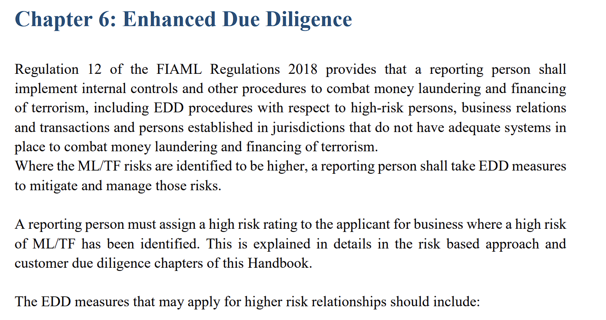

# bdo-gpt

# Table of Contents
1. [Installing Python](#python)
2. [Clone Repo](#repo)
2. [Installing LMStudio](#llm)
3. [Python Dependencies](#pip)
4. [Launching](#running)


## Installing Python
1.1: Verify if Python is Installed : 
```
python --version
```
If Python is not installed, install the latest version at : https://www.python.org/downloads/

1.2: Install PIP Package Manager
```
python get-pip.py
```
## Clone the Repository
Make a new folder
```
mkdir bdo-gpt
cd bdo-gpt
```

Clone the Repository or Download the .ZIP file at : https://github.com/MilindMe/privateGPT_v2.git

```
git clone https://github.com/MilindMe/privateGPT_v2.git
```
## Installing LM Studio
In order to run our LLM model locally, we need to download LMStudio. Head to https://lmstudio.ai/ to Download.

In LMStudio, click on Search and download the 'SanctumAI/Meta-Llama-3-8B-Instruct-GGUF' model


Once downloaded, click on Local Server and load the model. We can start the server once we have configured the rest of our python environment.

## Python Dependencies
To avoid Conflicting dependencies, we will first set up a virtual environment. The following command sets up a virtual environment called bdoGpt, and activates it:

**Windows Powershell**
```python
python -m venv bdoGpt
bdoGpt\Scripts\Activate.ps1
```

Once the virtual environment is set-up, we can install dependencies :
```python
pip install -r requirements.txt
```

## Launching
You can ensure dependencies have been installed by running
```python
pip list
```
* Head to LMStudio and start the server to expose API endpoints. 

At this point, you can choose to run the LLM directly through the PythonUI by opening another terminal window and running 
```
python -m streamlit run .\streamlit_ui.py
```

* **Recommended** : 
If you want to run the BDO-GPT Web application (built in REACT), we need to launch our Python Backend and the REACT frontend.
In VSCode, within the directory in which you cloned this repo, head into the backend folder and launch the python backend by running

```
python app.py
```
In another terminal window, run

```
npm run dev
```

    
